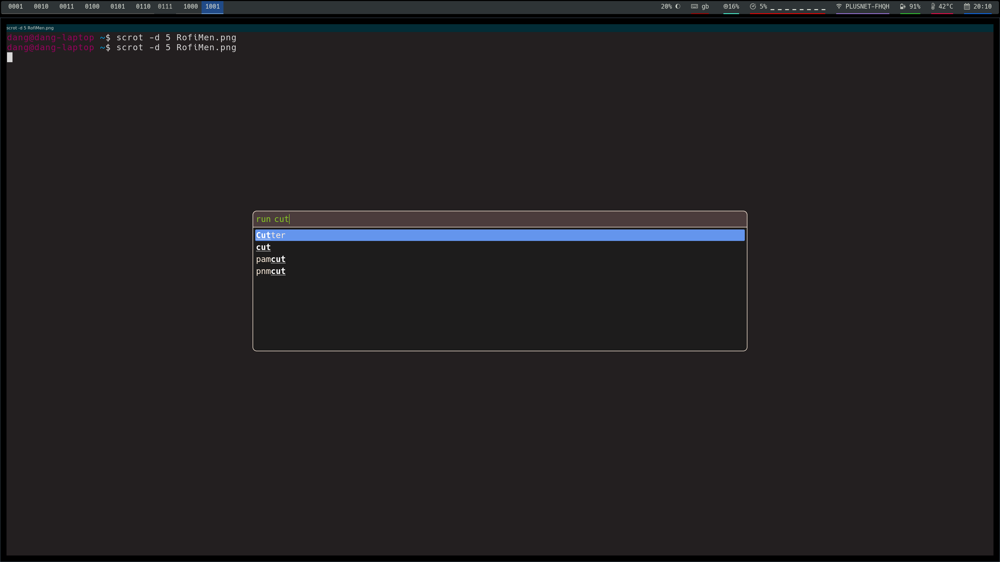

# My Custom Dotfiles

Dotfiles for a tiling WM based arch install

 - Herbstluft wm
 - Polybar
 - Rofi

## Preview




## Requirements

 - xorg-xserver
 - herbstlufwwm
 
 - git
 - xterm
 - oh-my-zsh
 - python
 - xorg-xbacklight
 - hack nerd fonts (AUR)
 - polybar (AUR)

## Dotbot

Used to manage the dotfiles themselves

https://github.com/anishathalye/dotbot
https://www.anishathalye.com/2014/08/03/managing-your-dotfiles/

```
./install -v
```

### Per Device configs

https://github.com/anishathalye/dotbot/wiki/Tips-and-Tricks#how-can-i-have-different-groups-of-tasks-for-different-hosts-with-different-configurations

We make use of the Meta/configs to have indiidual configs for applications

```
meta/profiels
```

Holds profiles for each of the different machines.

Current profiles

  - standard:   Laptop and VM
  - 4k: 4k Screens


# Configs

## XORG

 - .xinitrc   Use Herbsluft as WM,  set keyboard to GB
 - .Xresources:  Configuration for Xterm, Dark Scheme.

As we can preprocess (if C is installed) we do not need other configs here
for differing screen relosutions / machines.

## Herbstluft

  - i3lock
  - rofi
  - nitrogen
  - polybar
  
## ZSH

/usr/share/oh-my-zsh/templates/zshrc.zsh-template
  

## Polybar

Now has 4k settings and standard screens
Needs the Hack nerd font for Icons

BUGS:  Non Nice naming of Network Interfaces menas some of this doesnt show


